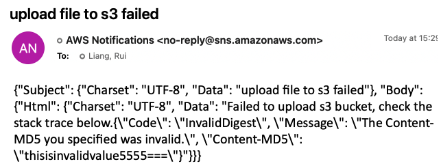

# How can I check the integrity of an object uploaded to Amazon S3

## Solution
1. Calculate the Content-MD5 value of the object.
2. Verify the integrity of the uploaded object by passing the Content-MD5 value as a request header during the object upload.

## Simulation
1. Calculate the Content-MD5 value of the object
```bash
sample_content_md5=`openssl md5 -binary awscliv2.zip | base64`
echo $sample_content_md5
```

2. upload object with Content-MD5 header
```bash
## Valid Content-MD5 header value
aws s3api put-object --bucket ray-data-engineering-lab --key raw_data/sample_data/awscliv2.zip --body awscliv2.zip
 --content-md5 $sample_content_md5

## Test with invalid header
aws s3api put-object --bucket ray-data-engineering-lab --key raw_data/sample_data/awscliv2.zip --body awscliv2.zip --content-md5 'thisisinvalidvalue5555==='

An error occurred (InvalidDigest) when calling the PutObject operation: The Content-MD5 you specified was invalid.
```

3. Fire alert when upload failed due to integrity check failed
Python code check the [check-s3-object-integrity](scripts/check-s3-object-integrity.py)

The sample email alert 


   
## Reference
[How can I check the integrity of an object uploaded to Amazon S3](https://aws.amazon.com/premiumsupport/knowledge-center/data-integrity-s3/)