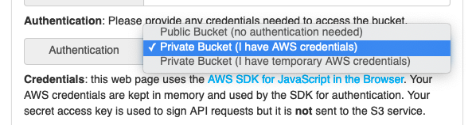
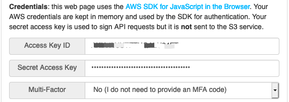
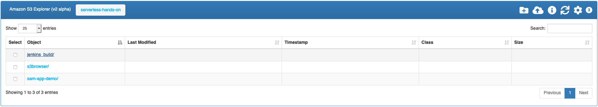

# AWS JavaScript S3 Explorer

AWS JavaScript S3 Explorer is a JavaScript application that uses AWS's JavaScript SDK and S3 APIs to make the contents of a public S3 bucket easy to browse via a web browser. 

## Public Bucket Edition

https://github.com/awslabs/aws-js-s3-explorer 

The index.html file in this bucket contains the entire application. A visitor to the index.html page is prompted to enter the name of an Amazon S3 bucket. Upon adding the bucket name, the contents of the bucket will be rendered on the page. All bucket you want to explorer is `Public` for everyone on the internet

1. Set the S3 bucket permissions - 
- A policy that allows anyone to see and access the contents of your bucket
```json
{
  "Version": "2012-10-17",
  "Statement": [
    {
      "Sid": "PublicListGet",
      "Effect": "Allow",
      "Principal": "*",
      "Action": [
        "s3:List*",
        "s3:Get*"
      ],
      "Resource": [
        "arn:aws-cn:s3:::BUCKET-NAME",
        "arn:aws-cn:s3:::BUCKET-NAME/*"
      ]
    }
  ]
}
```

- A policy restrict the set of source IPs that can access the contents of your bucket
```json
{
  "Version": "2012-10-17",
  "Statement": [
    {
      "Sid": "PrivateListGet",
      "Effect": "Allow",
      "Principal": "*",
      "Action": [
        "s3:List*",
        "s3:Get*"
      ],
      "Resource": [
        "arn:aws-cn:s3:::BUCKET-NAME",
        "arn:aws-cn:s3:::BUCKET-NAME/*"
      ],
      "Condition": {
          "IpAddress": {
              "aws:SourceIp": "203.0.113.0/24"
          }
      }
    }
  ]
}
```

2. S3 CORS Configuration

There are two URLs you can typically use to access your S3 explorer index.html file:

- https://BUCKET-NAME.s3.amazonaws.com/index.html (virtual-hosted-style URL, **No need enable CORS**, recommend)
- https://s3.amazonaws.com/BUCKET-NAME/index.html (path-style URL, **need to enable CORS**)
  1. Click the `CORS Configuration` button of your S3 bucket `Permissions` tab
  2. CORS Configuration
  ```json
  [
    {
        "AllowedHeaders": [
            "*"
        ],
        "AllowedMethods": [
            "HEAD",
            "GET"
        ],
        "AllowedOrigins": [
            "https://s3.cn-north-1.amazonaws.com.cn",
            "https://s3-cn-north-1.amazonaws.com.cn",
            "https://BUCKET1.s3.cn-north-1.amazonaws.com.cn"

        ],
        "ExposeHeaders": [
            "x-amz-meta-custom-header",
            "ETag"
        ],
        "MaxAgeSeconds": 3000
    }
  ]
  ```

3. Static Website Hosting
Upload the [index.html](https://github.com/awslabs/aws-js-s3-explorer/blob/master/index.html) to your bucket and enable the Static Website Hosting of your S3 bucket

## Private Bucket Edition

https://github.com/awslabs/aws-js-s3-explorer/tree/v2-alpha

You will work with two distinct S3 buckets:
1. The S3 bucket BUCKET1 hosting S3 Explorer tool
- store `index.html`, `explorer.css`, and `explorer.js` in BUCKET1, you can download from `scripts` folder.
- apply an S3 bucket policy to BUCKET1 that allows unauthenticated read of the 3 files
```json
{
  "Version": "2012-10-17",
  "Statement": [
    {
      "Sid": "S3ExplorerGetMinimal",
      "Effect": "Allow",
      "Principal": "*",
      "Action": "s3:Get*",
      "Resource": [
        "arn:aws-cn:s3:::BUCKET1/s3explorer/index.html",
        "arn:aws-cn:s3:::BUCKET1/s3explorer/explorer.css",
        "arn:aws-cn:s3:::BUCKET1/s3explorer/explorer.js"
      ]
    }
  ]
}
```


2. The S3 bucket BUCKET2 that you intend to use this tool to explore
- Configure IAM policy for allowing S3 Explorer to access to BUCKET2 (List, Download and Upload)
```json
{
  "Version": "2012-10-17",
  "Statement": [
    {
      "Effect": "Allow",
      "Action": [
        "s3:List*",
        "s3:Get*",
        "s3:Put*"
      ],
      "Resource": [
        "arn:aws-cn:s3:::BUCKET2",
        "arn:aws-cn:s3:::BUCKET2/*"
      ]
    }
  ]
}
```

Once you have created this IAM policy, you can attach the policy to an IAM user. IAM users with this policy can now use S3 Explorer to explore BUCKET2.

- Enabling CORS in BUCKET2

    BUCKET2 needs to have the proper Cross-Origin Resource Sharing (CORS) configuration allowing web pages hosted in BUCKET1 to make requests to BUCKET2.

    ```json
    [
        {
            "AllowedHeaders": [
                "*"
            ],
            "AllowedMethods": [
                "HEAD",
                "PUT",
                "POST",
                "GET"
            ],
            "AllowedOrigins": [
                "https://s3.cn-north-1.amazonaws.com.cn",
                "https://s3-cn-north-1.amazonaws.com.cn",
                "https://BUCKET1.s3.cn-north-1.amazonaws.com.cn"
            ],
            "ExposeHeaders": [
                "x-amz-server-side-encryption",
                "x-amz-request-id",
                "x-amz-id-2",
                "x-amz-meta-custom-header",
                "ETag",
                "date"
            ],
            "MaxAgeSeconds": 3000
        }
    ]
    ```

3. Use the S3 Explorer
- Open the hosted index.html file in your browser at https://BUCKET1.s3.cn-north-1.amazonaws.com.cn/index.html
- Click the S3 Explorer Setting, set the BUCKET2 or More BUCKET Name you want to access

- Choose `Private` Bucket BUCKET2 as the bucket name, if your bucket is `Public Access`, you can choice `Public Bucket` and no need set the credentials

- Supply your IAM credentials

- Accept the other default setting
- Click Query S3

- You can use the S3 Explorer Tab to `Create Folder`, `Upload`, `Get Info`, `Configure Setting`, `The object under current level`

  
- To Download File, Click the Filename.


# Reference
[MinIO S3 Gateway](https://docs.min.io/docs/minio-gateway-for-s3.html)