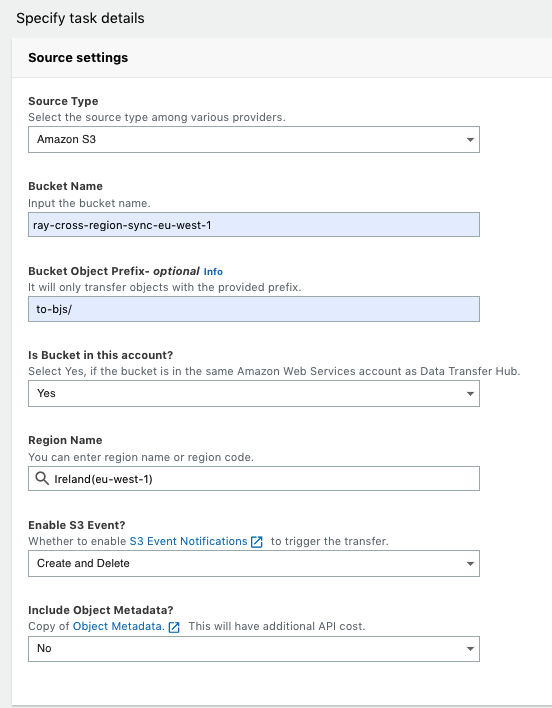
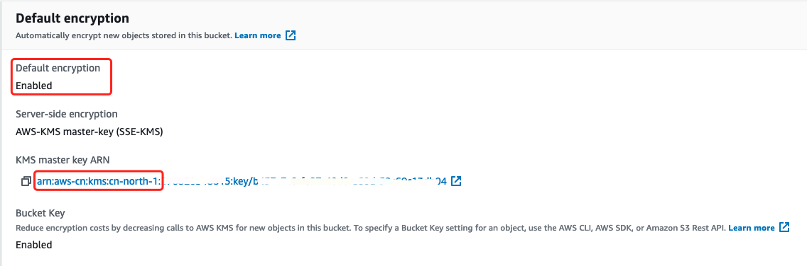
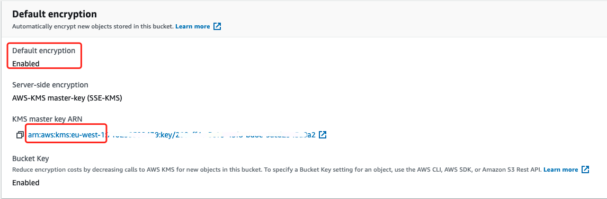
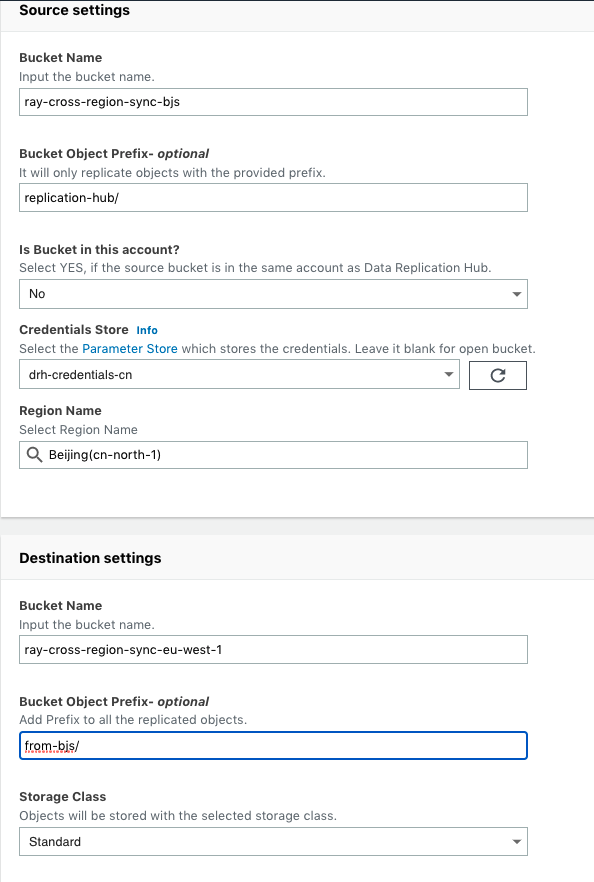

# Use the aws-data-transfer-hub to sync S3 data between Global bucket and China region bucket


The [aws-data-transfer-hub](https://github.com/awslabs/data-transfer-hub) is a reliable, secure, scalable AWS solution that enabled structured and unstructured data replication from different sources to AWS.

CHeck the release note： https://awslabs.github.io/data-transfer-hub/zh/revisions/

- Option 1: Deploy user data-transfer-hub portal and create job on the portal
- Option 2: Just want to run data-transfer-hub job (S3 sync job or ECR sync job) backend without portal support
- Test case: Enable the S3 SSE in both source and destination bucket to verify the replication job and read the data in destination

## Option 1: Deploy user data-transfer-hub portal and create job on the portal
1. Deploy the [CloudFormation Stack](https://www.amazonaws.cn/en/solutions/data-transfer-hub/) listed in the solution page in Global region, for example `eu-west-1 Ireland` region.

Right now data-transfer-hub will create new VPC to host the portal if you want to reuse existed VPC, you need directly deploy the S3 sync job or ECR sync job without Portal support.

2. Login into the data-transfer-hub Portal
- Check the output of the CloudFormation stack. The `PortalUrl` is the link of the portal.
- An email containing the temporary password will be sent to the provided email address. 
- You will be asked to set a new password when you login the portal


## Start to create your `Ningxia (cn-northwest-1)` region S3 bucket data to destination - `Ireland (eu-west-1)` region S3 bucket task.

  Here I replicate source - `Ningxia (cn-north-1)` region S3 bucket data to destination - `Ireland (eu-west-1)` region S3 bucket as example

  For the completed user guide, please visit [User Guide](https://github.com/awslabs/data-transfer-hub/blob/v2.0.0/docs/UserManual.md) for more information.

- Configure Credentials in Systems Manager Parameter Store for China region
  - `SecureString` as type
  - Input the credentials as text in Value, the credentials format should follow
  ```json
    {
      "access_key_id": "<Your Access Key ID>",
      "secret_access_key": "<Your Access Key Secret>"
    }
  ```

- Destination Type: S3


- Source



- Destination


- Check status


1. Source bucket data

    ```bash
    aws s3 ls s3://vod-mediaconvert-workshop-ray/inputs/ --region cn-northwest-1 --summarize --human-readable
    2019-10-17 00:42:07    0 Bytes 
    2019-10-17 00:50:07    5.0 MiB SampleVideo_1280x720_5mb.mp4
    2021-01-07 14:56:49   20.6 MiB TRAILER.mp4
    2021-01-07 14:56:49   88.6 MiB VANLIFE.m2ts
    2020-11-05 22:55:12    3.3 GiB beach_1h_1080p.mp4
    2020-11-05 20:58:39  215.9 MiB topgun_8m_1080p.mp4
    2020-11-05 21:34:15  964.6 MiB topgun_8m_2160p60.mp4

    Total Objects: 7
      Total Size: 4.5 GiB
    ```

  2. Destination data

    ```bash
    aws s3 ls s3://neptune-workshop-storage/cn-vod-inputs/inputs/ --region eu-west-1 --summarize --human-readable --profile us-east-1
    2021-02-01 13:36:03    0 Bytes
    2021-02-01 13:35:49    5.0 MiB SampleVideo_1280x720_5mb.mp4
    2021-02-01 13:35:46   20.6 MiB TRAILER.mp4
    2021-02-01 13:35:51   88.6 MiB VANLIFE.m2ts
    2021-02-01 13:35:46    3.3 GiB beach_1h_1080p.mp4
    2021-02-01 13:35:45  215.9 MiB topgun_8m_1080p.mp4
    2021-02-01 13:35:45  964.6 MiB topgun_8m_2160p60.mp4

    Total Objects: 7
      Total Size: 4.5 GiB
   ```

  3. CloudWatch


## Start to create `Ireland (eu-west-1)` region S3 bucket data to destination - `Ningxia (cn-northwest-1)` region S3 bucket task.

    Here I replicate source - `Ireland (eu-west-1)` region S3 bucket data to destination - `Ningxia (cn-northwest-1)` region S3 bucket as example

    For the completed user guide, please visit [User Guide](https://github.com/awslabs/data-transfer-hub/blob/v2.0.0/docs/UserManual.md) for more information.

- Configure Credentials in Systems Manager Parameter Store for China region
  - `SecureString` as type
  - Input the credentials as text in Value, the credentials format should follow
  ```json
    {
      "access_key_id": "<Your Access Key ID>",
      "secret_access_key": "<Your Access Key Secret>",
      "region_name": "<Your Region>"
    }
  ```

- Source


- Destination 


- Check status


1. Source
    ```bash
    aws s3 ls s3://neptune-workshop-storage/learning_media/ --summarize --human-readable --region eu-west-1
    2021-02-01 13:39:43    0 Bytes
    2021-02-01 13:51:45  117.6 MiB Apach Kylin Introduction.mp4
    2021-02-01 13:43:18  333.0 MiB DynamoDB_Deep_Dive_1.mp4
    2021-02-01 13:44:37  313.8 MiB DynamoDB_Deep_Dive_2.mp4
    2021-02-01 13:55:00  177.3 MiB FreeRTOS_Demo.mov
    2021-02-01 13:41:49  239.3 MiB Prerequisite_Networking_knowledge_when_you_starting_your_AWS_networking_trip_Part_2.mp4
    2021-02-01 13:52:27  233.8 MiB Redshift for new colleagues.mp4

    Total Objects: 7
      Total Size: 1.4 GiB
    ```

2. Destination data
    ```bash
    aws s3 ls s3://vod-mediaconvert-workshop-ray/lreland-learning-inputs/learning_media/ --region cn-northwest-1 --summarize --human-readable
    2021-02-01 14:17:47    0 Bytes
    2021-02-01 14:17:46  117.6 MiB Apach Kylin Introduction.mp4
    2021-02-01 14:17:45  333.0 MiB DynamoDB_Deep_Dive_1.mp4
    2021-02-01 14:17:54  313.8 MiB DynamoDB_Deep_Dive_2.mp4
    2021-02-01 14:17:49  177.3 MiB FreeRTOS_Demo.mov
    2021-02-01 14:17:46  239.3 MiB Prerequisite_Networking_knowledge_when_you_starting_your_AWS_networking_trip_Part_2.mp4
    2021-02-01 14:17:52  233.8 MiB Redshift for new colleagues.mp4

    Total Objects: 7
      Total Size: 1.4 GiB
    ```

## Option 2: Just want to run data-transfer-hub job
- [S3 Job](https://github.com/awslabs/amazon-s3-data-replication-hub-plugin)
- [ECR Job](https://github.com/awslabs/amazon-ecr-data-replication-hub-plugin)

1. Deploy S3 Job via AWS Cloudformation

| Parameter | Default | Description |
|--|--|--|
| sourceType | Amazon_S3 | Choose type of source storage, including Amazon_S3, Aliyun_OSS, Qiniu_Kodo, Tencent_COS, Google_GCS. |
| jobType | GET | Choose GET if source bucket is not in current account. Otherwise, choose PUT. |
| srcBucketName | | Source bucket name. |
| srcBucketPrefix | '' | Source bucket object prefix. The plugin will only copy keys with the certain prefix. |
| destBucketName | | Destination bucket name. |
| destBucketPrefix | '' | Destination bucket prefix. The plugin will upload to certain prefix. |
| destStorageClass | STANDARD | Destination Object Storage Class. Allowed options: 'STANDARD', 'STANDARD_IA', 'ONEZONE_IA', 'INTELLIGENT_TIERING' |
| ecsClusterName | | ECS Cluster Name to run ECS task |
| ecsVpcId | | VPC ID to run ECS task, e.g. vpc-bef13dc7 |
| ecsSubnets | | Subnet IDs to run ECS task. Please provide two subnets at least delimited by comma, e.g. subnet-97bfc4cd,subnet-7ad7de32 |
| credentialsParameterStore | '' | The Parameter Name used to keep credentials in Parameter Store. Leave it blank if you are replicating from open buckets. |
| regionName | '' | The Region Name, e.g. eu-west-1. For Google GCS, this is optional.
alarmEmail | | Alarm email. Errors will be sent to this email. |
| enableS3Event | No | Whether to enable S3 Event to trigger the replication. Only applicable if source is in Current account, default value is No. Allow options: 'No', 'Create_Only', 'Delete_Only', 'Create_And_Delete'. Note that Delete Marker Event is not support yet. |
| lambdaMemory | 256 | Lambda Memory, default to 256 MB. |
| multipartThreshold | 10 | Threshold Size for multipart upload in MB, default to 10 (MB) |
| chunkSize | 5 | Chunk Size for multipart upload in MB, default to 5 (MB) |
maxThreads | 10 | Max Theads to run multipart upload in lambda, default to 10 |

2. Check the CloudWatch for Job status


## Test case: Enable the S3 SSE in both source and destination bucket to verify the replication job and read the data in destination

1. Enable the S3 SSE in both source and destination bucket
- Source: Beijign region S3

- Destination: Ireland region S3


2. Create replication job from Beijign region S3 to Ireland region S3


3. Make sure the IAM credential you store in System Manager Parameter Store has proper permission for KMS usage and KMS CMK policy allow this IAM credential to use the CMK key. 
The IAM policy example:

```json
{
            "Sid": "Allow use of the key",
            "Effect": "Allow",
            "Principal": {
                "AWS": [
                    "arn:aws-cn:iam::account-id:user/demouser"
                ]
            },
            "Action": [
                "kms:Encrypt",
                "kms:Decrypt",
                "kms:ReEncrypt*",
                "kms:GenerateDataKey*",
                "kms:DescribeKey"
            ],
            "Resource": "*"
        }
```

3. Modify the IAM Role `S3MigrationWorkerServiceRole`  used by Worker Lambda for example `DRH-S3-pOwAE-S3MigrationWorkerServiceRole68252FCB-N90YHQ9Y7TYL` with proper KMS permission and KMS CMK key policy to allow this role to use the CMK key. 
The CMK key policy example:

```json
{
            "Sid": "Allow use of the key",
            "Effect": "Allow",
            "Principal": {
                "AWS": [
                    "arn:aws:iam::account-id:user/demouser",
                    "arn:aws:iam::account-id:role/DRH-S3-pOwAE-S3MigrationWorkerServiceRole68252FCB-N90YHQ9Y7TYL"
                ]
            },
            "Action": [
                "kms:Encrypt",
                "kms:Decrypt",
                "kms:ReEncrypt*",
                "kms:GenerateDataKey*",
                "kms:DescribeKey"
            ],
            "Resource": "*"
        }
```

4. Verify the files in destination bucket can be download and open correct

Due to S3 SSE is transparent to end user, so when aws-data-transfer-hub lambda to read files from source bucket, the files will be decrypted by using source account KMS CMK, and then synchronized to destination bucket. And destination bucket SSE will automatically handle the files encryption using destination account KMS CMK 