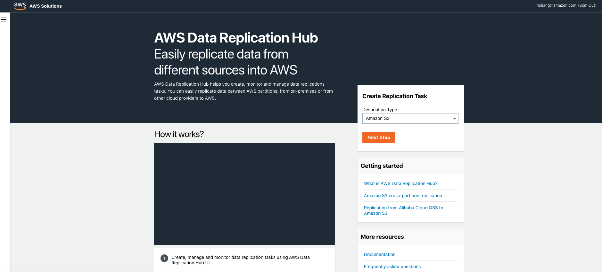
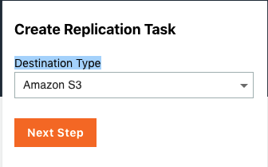
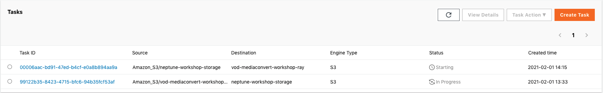
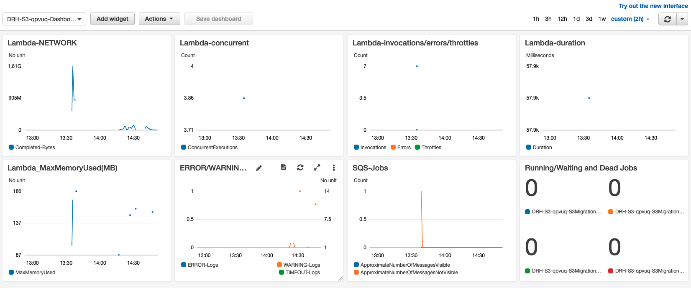
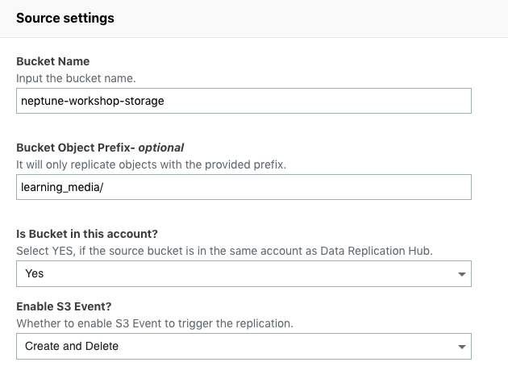

# Use the aws-data-replication-hub to sync S3 data between Global bucket and China region bucket


[aws-data-replication-hub](https://github.com/awslabs/aws-data-replication-hub) is a reliable, secure, scalable AWS solution that enabled structured and unstructured data replication from different sources to AWS.

1. Deploy the [CloudFormation Stack](https://console.aws.amazon.com/cloudformation/home#/stacks/create/template?stackName=DataReplicationHub&templateURL=https://aws-gcr-solutions.s3.amazonaws.com/Aws-data-replication-hub/latest/AwsDataReplicationHub-cognito.template) in Global region, for example `eu-west-1 Ireland` region.

2. Login into the Data Replication Hub Portal
- Check the output of the CloudFormation stack. The `PortalUrl` is the link of the portal.
- An email containing the temporary password will be sent to the provided email address. 
- You will be asked to set a new password when you login the portal


3. Start to create your first replication task.

  Here I replicate source - `Ningxia (cn-northwest-1)` region S3 bucket data to destination - `Ireland (eu-west-1)` region S3 bucket as example

  For the completed user guide, please visit [User Guide](https://github.com/awslabs/aws-data-replication-hub/blob/master/docs/UserManual.md) for more information.

- Configure Credentials in Systems Manager Parameter Store for China region
  - `SecureString` as type
  - Input the credentials as text in Value, the credentials format should follow
  ```json
    {
      "access_key_id": "<Your Access Key ID>",
      "secret_access_key": "<Your Access Key Secret>",
      "region_name": "<Your Region>"
    }
  ```

- Destination Type: S3


- Source
！[S3-replicate-task-source](media/S3-replicate-task-source.png)

- Destination
！[S3-replicate-task-destination](media/S3-replicate-task-destination.png)

- Check status

    1. Source bucket data
    ```bash
    aws s3 ls s3://vod-mediaconvert-workshop-ray/inputs/ --region cn-northwest-1 --summarize --human-readable
    2019-10-17 00:42:07    0 Bytes 
    2019-10-17 00:50:07    5.0 MiB SampleVideo_1280x720_5mb.mp4
    2021-01-07 14:56:49   20.6 MiB TRAILER.mp4
    2021-01-07 14:56:49   88.6 MiB VANLIFE.m2ts
    2020-11-05 22:55:12    3.3 GiB beach_1h_1080p.mp4
    2020-11-05 20:58:39  215.9 MiB topgun_8m_1080p.mp4
    2020-11-05 21:34:15  964.6 MiB topgun_8m_2160p60.mp4

    Total Objects: 7
      Total Size: 4.5 GiB
    ```
  2. Destination data
    ```bash
    aws s3 ls s3://neptune-workshop-storage/cn-vod-inputs/inputs/ --region eu-west-1 --summarize --human-readable --profile us-east-1
    2021-02-01 13:36:03    0 Bytes
    2021-02-01 13:35:49    5.0 MiB SampleVideo_1280x720_5mb.mp4
    2021-02-01 13:35:46   20.6 MiB TRAILER.mp4
    2021-02-01 13:35:51   88.6 MiB VANLIFE.m2ts
    2021-02-01 13:35:46    3.3 GiB beach_1h_1080p.mp4
    2021-02-01 13:35:45  215.9 MiB topgun_8m_1080p.mp4
    2021-02-01 13:35:45  964.6 MiB topgun_8m_2160p60.mp4

    Total Objects: 7
      Total Size: 4.5 GiB
   ```

  3. CloudWatch
  

4. Start to create your second replication task.

    Here I replicate source - `Ireland (eu-west-1)` region S3 bucket data to destination - `Ningxia (cn-northwest-1)` region S3 bucket as example

    For the completed user guide, please visit [User Guide](https://github.com/awslabs/aws-data-replication-hub/blob/master/docs/UserManual.md) for more information.

- Configure Credentials in Systems Manager Parameter Store for China region
  - `SecureString` as type
  - Input the credentials as text in Value, the credentials format should follow
  ```json
    {
      "access_key_id": "<Your Access Key ID>",
      "secret_access_key": "<Your Access Key Secret>",
      "region_name": "<Your Region>"
    }
  ```

- Source

- Destination 

    

- Check status

    1. Source
    ```bash
    aws s3 ls s3://neptune-workshop-storage/learning_media/ --summarize --human-readable --region eu-west-1
    2021-02-01 13:39:43    0 Bytes
    2021-02-01 13:51:45  117.6 MiB Apach Kylin Introduction.mp4
    2021-02-01 13:43:18  333.0 MiB DynamoDB_Deep_Dive_1.mp4
    2021-02-01 13:44:37  313.8 MiB DynamoDB_Deep_Dive_2.mp4
    2021-02-01 13:55:00  177.3 MiB FreeRTOS_Demo.mov
    2021-02-01 13:41:49  239.3 MiB Prerequisite_Networking_knowledge_when_you_starting_your_AWS_networking_trip_Part_2.mp4
    2021-02-01 13:52:27  233.8 MiB Redshift for new colleagues.mp4

    Total Objects: 7
      Total Size: 1.4 GiB
    ```

    2. Destination data
    ```bash
    aws s3 ls s3://vod-mediaconvert-workshop-ray/lreland-learning-inputs/learning_media/ --region cn-northwest-1 --summarize --human-readable
    2021-02-01 14:17:47    0 Bytes
    2021-02-01 14:17:46  117.6 MiB Apach Kylin Introduction.mp4
    2021-02-01 14:17:45  333.0 MiB DynamoDB_Deep_Dive_1.mp4
    2021-02-01 14:17:54  313.8 MiB DynamoDB_Deep_Dive_2.mp4
    2021-02-01 14:17:49  177.3 MiB FreeRTOS_Demo.mov
    2021-02-01 14:17:46  239.3 MiB Prerequisite_Networking_knowledge_when_you_starting_your_AWS_networking_trip_Part_2.mp4
    2021-02-01 14:17:52  233.8 MiB Redshift for new colleagues.mp4

    Total Objects: 7
      Total Size: 1.4 GiB
    ```