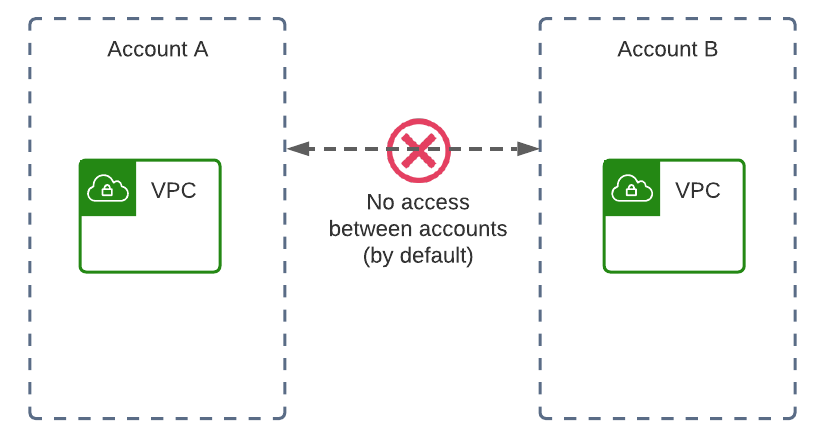
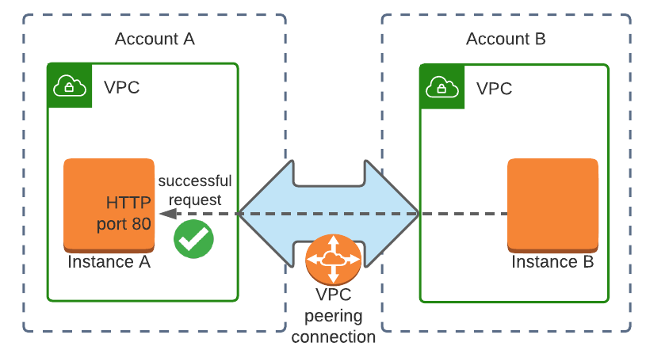
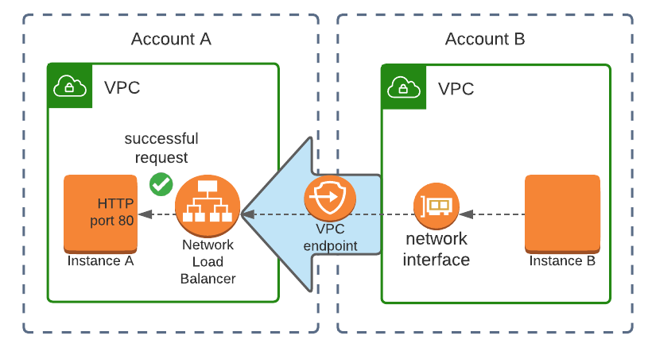
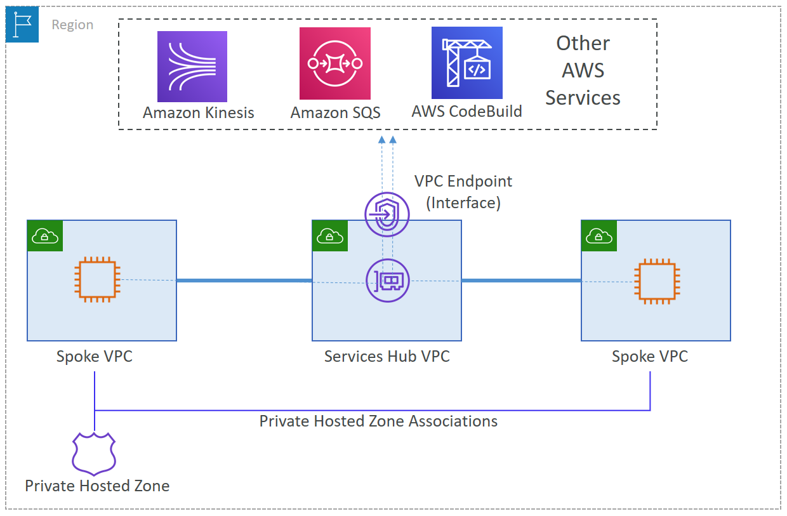

# VPC Cross account connection

Here we only discuss using VPC technology to do cross account connection. Using Direct Connect, SD-WAN, VPN connection can be other options, but out-of-scope this document.
Cloud to Cloud connection (you can treat BBA as other Cloud as well to extend the inside Cloud connection)
1.	Direct connect – Regular connection (owned by customer) and hosted connection (Owned by Direct connect provider, customer accept the VIF assigned by provider) + Transit Gateway GW Direct connect attachment
2.	SD-WAN – SD-WAN application installed on EC2 + Transit Gateway Connect
3.	IPSec VPN over Internect – VPN application installed on EC2 + Transit Gateway Connect 

## By default, an AWS account cannot access resources from a different account.

## Option 1: VPC peering connection cross-account access

- [How to create-vpc-peering-connection](https://docs.aws.amazon.com/vpc/latest/peering/create-vpc-peering-connection.html)
- Setup the peering [using CloudFormation](https://docs.aws.amazon.com/AWSCloudFormation/latest/UserGuide/peer-with-vpc-in-another-account.html )
 

## Option 2: VPC endpoint service (PrivateLink) cross-account access

- PrivateLink is focus on Service level one-way inter-connection 
  - Private Access to SaaS Applications; 
  - Shared Services; 
  - Hybrid Services; 
  - Inter-Region Endpoint Services; 
  - Inter-Region Access to Endpoint Services
- Example [how to access services exposed by other account via PrivateLink](https://aws.amazon.com/blogs/compute/building-private-cross-account-apis-using-amazon-api-gateway-and-aws-privatelink/) 
- Customer can leverage [Centralize access using VPC interface endpoints to access AWS services across multiple VPCs](https://aws.amazon.com/blogs/networking-and-content-delivery/centralize-access-using-vpc-interface-endpoints/) to support shared service cloudroom access  

## Option 3: Transit gateway cross-account access
- [Multi account associate tgw](https://docs.aws.amazon.com/directconnect/latest/UserGuide/multi-account-associate-tgw.html) 
- Customer can use Option2 and Option3 together for central control and replace the VPC peering. 

 
## Summary: 
| Items | VPC Peering | VPC Endpoint | Transit Gateway  |
| ---- | ---- | ---- | ----|
| Direction | Two-way | One-way | Two-way  |
| Pre-requisites | No-overlapping CIDR block between VPCs | Network load balancer | No-overlapping CIDR block between VPCs. Shared transit gateway through Resource Access Manager.  |
|  Maximum throughput | No limit, but up to 50 peering per VPC	10 Gbps (40 Gbps burst); up to 50 interface endpoints and GWLB endpoint | 50 Gbps burst per VPC; up to 5 TGW per account and per VPC  | 5000 Attachments per transit gateway, Maximum bandwidth per VPC, AWS Direct Connect gateway, or peered transit gateway connection 50Gbps
| Integration | Can not Transitive peering | VPC interface endpoint can over DX/VPN | TGW integrated with VPN via TGW Connect and integrated with DX with TGW DXGateway Attachment
| Cost | No hourly cost; Same region cross-AZ data transfer costs | Hourly cost; Data transfer cost; Network load balancer cost | Hourly cost per attachment; Data transfer cost  |

# Reference
[cross-account-vpc-access-in-aws](https://tomgregory.com/cross-account-vpc-access-in-aws/ )