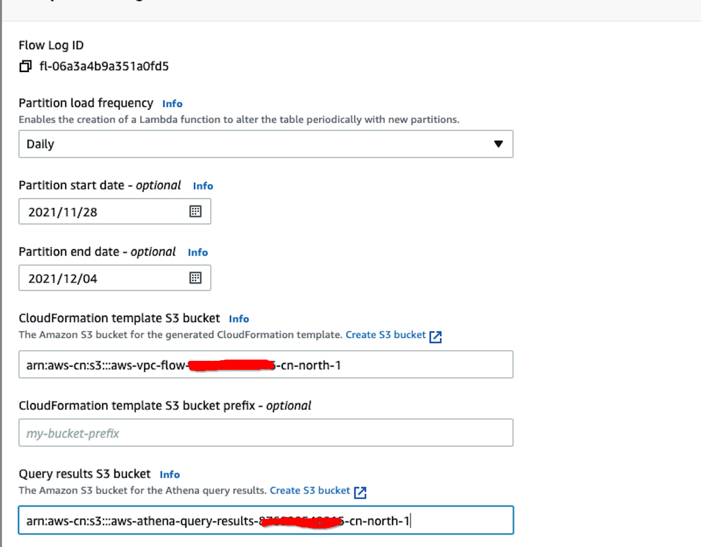

# How to check the Internet Traffic?

## For NAT Gateway, EC2 and Load Balancer, you can analysis the VPC flow logs

1. Create the flow log

https://docs.amazonaws.cn/en_us/vpc/latest/userguide/working-with-flow-logs.html


2. Query flow logs using Amazon Athena

https://docs.amazonaws.cn/en_us/vpc/latest/userguide/flow-logs-athena.html



- In the success message, choose the link to navigate to the bucket that you specified for the CloudFormation template, and customize the template: such as the nodejs runtime you can set to `Runtime: nodejs14.x`

- Then use the CloudFormation stack to complete the resources deployment that are specified in the template.

- Then you can run the [predefined query](https://docs.amazonaws.cn/en_us/vpc/latest/userguide/flow-logs-athena.html#flow-logs-run-athena-query)

For example: `VpcFlowLogsTotalBytesTransferred` – The 50 pairs of source and destination IP addresses with the most bytes recorded.


```sql
SELECT SUM(bytes) as totalbytes, srcaddr, dstaddr from fl06a3a4b9a351a0fd5daily2021120420211204 WHERE year='2021' AND month='12' AND day='04' GROUP BY srcaddr, dstaddr ORDER BY totalbytes LIMIT 50
```

3. Trouble shooting
- If you find the Athena query status is `cancelled`, Please check the Athena workgroup scan limit and increase it. More infomation, please check https://docs.amazonaws.cn/athena/latest/ug/workgroups-setting-control-limits-cloudwatch.html

- Patition: S3 bucket prefix need follow up the pattern `aws-region=region/year=year/month=month/day=day/`, then you can enable automatic partition and use the `msck repair table <table-name>` to automatically identify and load the partition. If you path format is `region/year/month/day/`, then you need manually load the partition via `alter table ... add partition(...) ... location ...`
```sql
   ALTER TABLE fl06a3a4b9a351a0fd5daily2021120420211204 ADD 
   PARTITION (
              year='2021',
              month='12',
              day='06')
   LOCATION 's3://aws-vpc-flow-bucket/AWSLogs/AccountID/vpcflowlogs/AWSRegion/2021/12/06/'
```

- If you set the `Partition load frequency` in your VPC Flow logs athena integration, then it will follow up the frequency to load the partition

- performance tuning
1. In global region, you can store the flow logs as Parquet format when you create the flow logs [analytics with VPC Flow Logs in Apache Parquet format](https://aws.amazon.com/blogs/big-data/optimize-performance-and-reduce-costs-for-network-analytics-with-vpc-flow-logs-in-apache-parquet-format/).

2. In China region, you can use glue job to convert the data to Parquet without change the table schema
- Note， modify the script to add the `"partitionKeys": ["year", "month", "day"]`
```python
datasink4 = glueContext.write_dynamic_frame.from_options(frame = dropnullfields3, connection_type = "s3", connection_options = {"path": "s3://aws-vpc-flow-bucket/Parquet/", "partitionKeys": ["year", "month", "day"]}, format = "parquet", transformation_ctx = "datasink4")
```

3. Create new table by using Glue Crawler or in Athena
```sql
CREATE EXTERNAL TABLE `flow_logs_parquet`(
  `version` int, 
  `account_id` string, 
  `interface_id` string, 
  `srcaddr` string, 
  `dstaddr` string, 
  `srcport` int, 
  `dstport` int, 
  `protocol` bigint, 
  `packets` bigint, 
  `bytes` bigint, 
  `start` bigint, 
  `end` bigint, 
  `action` string, 
  `log_status` string)
PARTITIONED BY ( 
  `year` string, 
  `month` string, 
  `day` string)
ROW FORMAT SERDE 
  'org.apache.hadoop.hive.ql.io.parquet.serde.ParquetHiveSerDe' 
STORED AS INPUTFORMAT 
  'org.apache.hadoop.hive.ql.io.parquet.MapredParquetInputFormat' 
OUTPUTFORMAT 
  'org.apache.hadoop.hive.ql.io.parquet.MapredParquetOutputFormat'
LOCATION
  's3://aws-vpc-flow-bucket/Parquet/'
TBLPROPERTIES (
  'classification'='parquet',  
  "parquet.compress"="SNAPPY")


MSCK REPAIR TABLE `flow_logs_parquet`;
```

## For S3, you can analysis the S3 access logs or Cloud Trail logs

### S3 access logs
1. Enable the [S3 server access logging](https://docs.amazonaws.cn/en_us/AmazonS3/latest/userguide/enable-server-access-logging.html)

2. Using the [Athena to do query](https://docs.amazonaws.cn/en_us/AmazonS3/latest/userguide/using-s3-access-logs-to-identify-requests.html)

Example:

```sql
create database s3_access_logs_db

CREATE
EXTERNAL TABLE `s3_access_logs_db.ray-glue-streaming_logs`(
  `bucketowner` STRING, 
  `bucket_name` STRING, 
  `requestdatetime` STRING, 
  `remoteip` STRING, 
  `requester` STRING, 
  `requestid` STRING, 
  `operation` STRING, 
  `key` STRING, 
  `request_uri` STRING, 
  `httpstatus` STRING, 
  `errorcode` STRING, 
  `bytessent` BIGINT, 
  `objectsize` BIGINT, 
  `totaltime` STRING, 
  `turnaroundtime` STRING, 
  `referrer` STRING, 
  `useragent` STRING, 
  `versionid` STRING, 
  `hostid` STRING, 
  `sigv` STRING, 
  `ciphersuite` STRING, 
  `authtype` STRING, 
  `endpoint` STRING, 
  `tlsversion` STRING)
ROW FORMATSERDE 
  'org.apache.hadoop.hive.serde2.RegexSerDe' 
WITH SERDEPROPERTIES ( 
  'input.regex'='([^ ]*) ([^ ]*) \\[(.*?)\\]
([^ ]*) ([^ ]*) ([^ ]*) ([^ ]*) ([^ ]*) (\"[^\"]*\"|-)
(-|[0-9]*) ([^ ]*) ([^ ]*) ([^ ]*) ([^ ]*) ([^ ]*) ([^ ]*)
(\"[^\"]*\"|-) ([^ ]*)(?: ([^ ]*) ([^ ]*) ([^ ]*) ([^ ]*) ([^
]*) ([^ ]*))?.*$') 
STORED AS INPUTFORMAT 
  'org.apache.hadoop.mapred.TextInputFormat' 
OUTPUTFORMAT
  'org.apache.hadoop.hive.ql.io.HiveIgnoreKeyTextOutputFormat'
LOCATION 's3://ray-accesslogs-bjs/s3_access/'
```

- query Top 50 Download IP
```sql
SELECT SUM(objectsize) AS downloadTotal, remoteip
FROM "s3_access_logs_db"."ray-glue-streaming_logs"
WHERE Operation='REST.GET.OBJECT' AND
parse_datetime(requestdatetime,'dd/MMM/yyyy:HH:mm:ss Z')
BETWEEN parse_datetime('2021-12-01','yyyy-MM-dd')
AND parse_datetime('2021-12-05','yyyy-MM-dd')
GROUP BY remoteip
ORDER BY downloadTotal LIMIT 50;
```

- query Top 50 Copy data IP
```sql
SELECT SUM(objectsize) AS downloadTotal, remoteip
FROM "s3_access_logs_db"."ray-glue-streaming_logs"
WHERE Operation='REST.COPY.OBJECT_GET' AND
parse_datetime(requestdatetime,'dd/MMM/yyyy:HH:mm:ss Z')
BETWEEN parse_datetime('2021-12-01','yyyy-MM-dd')
AND parse_datetime('2021-12-05','yyyy-MM-dd')
GROUP BY remoteip
ORDER BY downloadTotal LIMIT 50;
```

### S3 CloudTrail logs
1. [Enable logging for objects in a bucket](https://docs.aws.amazon.com/AmazonS3/latest/userguide/enable-cloudtrail-logging-for-s3.html)

- CloudTrail supports logging Amazon S3 object-level API operations such as GetObject, DeleteObject, and PutObject. These events are called data events. By default, CloudTrail trails don't log data events, but you can configure trails to log data events for S3 buckets that you specify, or to log data events for all the Amazon S3 buckets in your AWS account.


2. [Identifying Amazon S3 requests using CloudTrail](https://docs.aws.amazon.com/AmazonS3/latest/userguide/cloudtrail-request-identification.html)

3. Partition consideration

***Note: You need run the Athena in the same region of your cloud trail S3 bucket to avoid cross region query error***

- Manual Partition
    - [Manual load Partition](https://docs.aws.amazon.com/athena/latest/ug/cloudtrail-logs.html#create-cloudtrail-table)
    ```sql
    CREATE DATABASE s3_cloudtrail_events_db

    CREATE EXTERNAL TABLE cloudtrail_logs (
    eventversion STRING,
    useridentity STRUCT<
                type:STRING,
                principalid:STRING,
                arn:STRING,
                accountid:STRING,
                invokedby:STRING,
                accesskeyid:STRING,
                userName:STRING,
    sessioncontext:STRUCT<
    attributes:STRUCT<
                mfaauthenticated:STRING,
                creationdate:STRING>,
    sessionissuer:STRUCT<  
                type:STRING,
                principalId:STRING,
                arn:STRING, 
                accountId:STRING,
                userName:STRING>>>,
    eventtime STRING,
    eventsource STRING,
    eventname STRING,
    awsregion STRING,
    sourceipaddress STRING,
    useragent STRING,
    errorcode STRING,
    errormessage STRING,
    requestparameters STRING,
    responseelements STRING,
    additionaleventdata STRING,
    requestid STRING,
    eventid STRING,
    resources ARRAY<STRUCT<
                ARN:STRING,
                accountId:STRING,
                type:STRING>>,
    eventtype STRING,
    apiversion STRING,
    readonly STRING,
    recipientaccountid STRING,
    serviceeventdetails STRING,
    sharedeventid STRING,
    vpcendpointid STRING
    )
    PARTITIONED BY (region string, year string, month string, day string)
    ROW FORMAT SERDE 'com.amazon.emr.hive.serde.CloudTrailSerde'
    STORED AS INPUTFORMAT 'com.amazon.emr.cloudtrail.CloudTrailInputFormat'
    OUTPUTFORMAT 'org.apache.hadoop.hive.ql.io.HiveIgnoreKeyTextOutputFormat'
    LOCATION 's3://CloudTrail_bucket_name/AWSLogs/Account_ID/CloudTrail/';

    ALTER TABLE cloudtrail_logs ADD 
   PARTITION (region='cn-north-1',
              year='2021',
              month='12',
              day='05')
   LOCATION 's3://CloudTrail_bucket_name/AWSLogs/Account_ID/CloudTrail/cn-north-1/2021/12/05/'
    ```

    - Query with partition
    ```sql
    -- Aggegrate by useridentity.arn
    SELECT useridentity.arn,
    Count(requestid) AS RequestCount
    FROM s3_cloudtrail_events_db.cloudtrail_logs
    WHERE eventsource='s3.amazonaws.com'
    AND region='cn-north-1'
    AND year='2021'
    AND month='12'
    AND day='05'
    Group by useridentity.arn limit 20  

    -- Aggregate by sourceipaddress
    SELECT count(requestid), sourceipaddress 
    FROM s3_cloudtrail_events_db.cloudtrail_logs
    WHERE eventsource='s3.amazonaws.com'
    AND region='cn-north-1'
    AND year='2021'
    AND month='12'
    AND day='05'
    AND eventname in ('GetObject')
    AND sourceipaddress not in ('AWS Internal', 'athena.amazonaws.com')
    group by sourceipaddress limit 20

    -- Aggregate by eventname
    SELECT count(requestid), eventname
    FROM s3_cloudtrail_events_db.cloudtrail_logs
    WHERE eventsource='s3.amazonaws.com'
    AND region='cn-north-1'
    AND year='2021'
    AND month='12'
    AND day='06'
    AND sourceipaddress not in ('AWS Internal', 'athena.amazonaws.com')
    group by eventname limit 20 

    -- Check event details
    SELECT
      eventTime, 
      eventName, 
      sourceIpAddress, 
      json_extract_scalar(requestParameters, '$.bucketName') as bucketName, 
      json_extract_scalar(requestParameters, '$.key') as object,
      userIdentity.arn as userArn
    FROM s3_cloudtrail_events_db.cloudtrail_logs
    WHERE eventsource='s3.amazonaws.com'
    AND region='cn-north-1'
    AND year='2021'
    AND month='12'
    AND day='06'
    AND sourceipaddress not in ('AWS Internal', 'athena.amazonaws.com')
    limit 100 
    ```
- Automatically Partition Projection
    - [Automatically add the partition](https://docs.aws.amazon.com/athena/latest/ug/cloudtrail-logs.html#create-cloudtrail-table-partition-projection)
    - Load partition
    ```sql
    MSCK REPAIR TABLE `cloudtrail_logs_pp`;
    ```


4. Using Glue to create the Parquet format
- Glue job
```python

import sys
from awsglue.transforms import *
from awsglue.utils import getResolvedOptions
from pyspark.context import SparkContext
from awsglue.context import GlueContext
from awsglue.job import Job

args = getResolvedOptions(sys.argv, ["JOB_NAME", "glue_database", "raw_cloudtrail_table", "results_bucket", "TempDir"])
sc = SparkContext()
glueContext = GlueContext(sc)
spark = glueContext.spark_session
job = Job(glueContext)
job.init(args["JOB_NAME"], args)
datasource0 = glueContext.create_dynamic_frame.from_catalog(database = args["glue_database"], table_name = args["raw_cloudtrail_table"], transformation_ctx = "datasource0")
applymapping1 = ApplyMapping.apply(frame = datasource0, mappings = [("eventversion", "string", "eventversion", "string"), ("useridentity", "struct", "useridentity", "struct"), ("eventtime", "string", "eventtime", "string"), ("eventsource", "string", "eventsource", "string"), ("eventname", "string", "eventname", "string"), ("awsregion", "string", "awsregion", "string"), ("sourceipaddress", "string", "sourceipaddress", "string"), ("useragent", "string", "useragent", "string"), ("requestparameters", "struct", "requestparameters", "string"), ("responseelements", "struct", "responseelements", "string"), ("requestid", "string", "requestid", "string"), ("eventid", "string", "eventid", "string"), ("eventtype", "string", "eventtype", "string"), ("recipientaccountid", "string", "recipientaccountid", "string"), ("resources", "array", "resources", "array"), ("sharedeventid", "string", "sharedeventid", "string"), ("errorcode", "string", "errorcode", "string"), ("errormessage", "string", "errormessage", "string"), ("apiversion", "string", "apiversion", "string"), ("readonly", "boolean", "readonly", "boolean"), ("additionaleventdata", "struct", "additionaleventdata", "string"), ("vpcendpointid", "string", "vpcendpointid", "string"), ("managementevent", "boolean", "managementevent", "boolean"), ("eventcategory", "string", "eventcategory", "string"), ("serviceeventdetails", "struct", "serviceeventdetails", "struct"), ("partition_0", "string", "organization", "string"), ("partition_2", "string", "account", "string"), ("partition_4", "string", "region", "string"), ("partition_5", "string", "year", "string"), ("partition_6", "string", "month", "string"), ("partition_7", "string", "day", "string")], transformation_ctx = "applymapping1")
resolvechoice2 = ResolveChoice.apply(frame = applymapping1, choice = "make_struct", transformation_ctx = "resolvechoice2")
relationalized3 = resolvechoice2.relationalize("trail", args["TempDir"]).select("trail")
datasink4 = glueContext.write_dynamic_frame.from_options(frame = relationalized3, connection_type = "s3", connection_options = {"path": args["results_bucket"] + "/parquet", "partitionKeys": ["account", "region", "year", "month", "day"]}, format = "parquet", transformation_ctx = "datasink4")
job.commit()
```
- Whole pipeline: https://github.com/alsmola/cloudtrail-parquet-glue